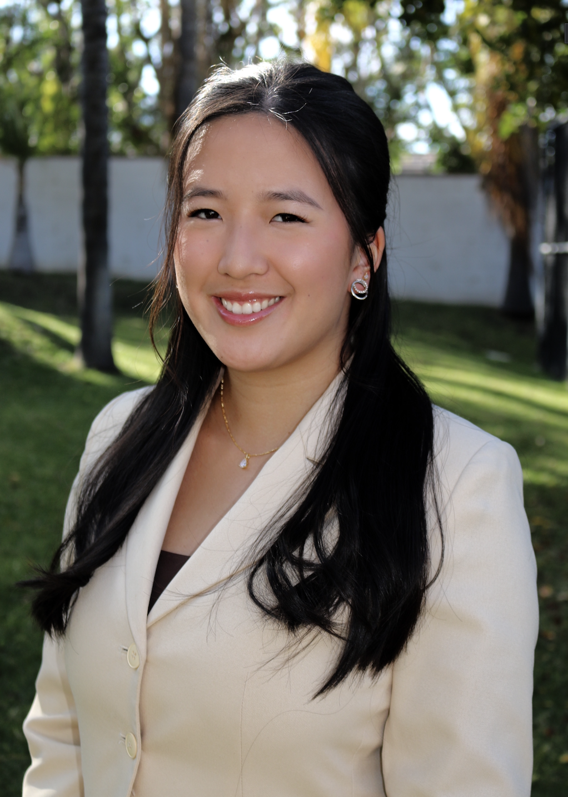

<button><a href="#Introduction">Introduction</a></button>
<button><a href="#Education">Education</a></button>
<button><a href="#Experience">Previous Experiences</a></button>

## A Little About Me...

  

    

        
        <a href="https://www.linkedin.com/in/vivian-esther-lin/" class="button" target="_blank">LinkedIn</a>
    

Hello! My name is Vivian, and I am a Data Science Major with a Business minor at the University of California, San Diego. I became a data scientist because I love converting numbers into actionable information. Making data-driven decisions is the smartest thing a company can do at every level, whether it be operations, supply chain, or consumer marketing, and I want to contribute to a team that makes that possible. My resumè is available upon request. Please take a look around to see the internships and leadership positions I've held, as well as projects I have completed! 

## My Previous Experiences

<strong>Data Science Tutor @Halıcıoğlu Data Science Institute</strong>
September 2022 - Present
<ul>
  <li>Answer 300+ questions on the online class forum and develop 10+ LaTeX rubrics for grading assignments and exams</li>
  <li>Host weekly office hours for students to gain a better understanding on regression and statistical concepts</li>
  <li>Excelled in formulating total of 15 homeworks/exams, and stayed for extra time at office hours to help all students</li>
</ul>

 

<strong>Software Engineer Intern @Dassault Systèmes</strong>
June 2023 - September 2023
<ul>
  <li>Created protocols for clients to test regression and classification models and standardize repetitive prediction model tasks</li>
  <li>Eliminated inefficiency and errors in R regression protocols within data pipelining engine to run on 17 versions of R</li>
  <li>Developed Python components to improve application development environment to increase clients’ comprehension</li>
</ul>

 

<strong>Machine Learning Intern @Hyperplane</strong>
June 2022 - September 2022
<ul>
  <li>Analyzed a dataset composed of millions of financial data points using BigQuery on Google Cloud Platform</li>
  <li>Deployed insights from queries to build distributed data ingestion and processing pipelines to predict customers’ income</li>
  <li>Wrote, tested, and implemented regression and classification prediction models to provide further data comprehension</li>
</ul>

 

<strong>Data Analytics Intern @Lumnus Consulting</strong>
April 2023 - June 2023
<ul>
  <li>Led a team to utilize exploratory data analysis and computational skills to gain insights on how to continue growing India's agriculture market despite rising carbon emissions and concluded with a presentation to all teams </li>
  <li>Leveraged social media data to find optimal ways to increase brand awareness, user engagement, and client acquisition </li>
</ul>

## Education

University of California, San Diego
<space></space><space></space>B.S. - Data Science
   
<space></space><space></space><space></space><space></space>Minor: Business
<ul>
  <li><strong>Relevant Coursework</strong>: Probabilistic Modeling and ML, Representation Learning, Systems for Scalable Analytics, Recommender Systems and Web Mining, Data Structures and Algorithms, Data Analysis and Inference, Product Management and Marketing</li>
  <li><strong>Involvements</strong>: Data Science Student Society, Society of Women Engineers, Delta Sigma Pi, Chinese American Student Association</li>
</ul>

